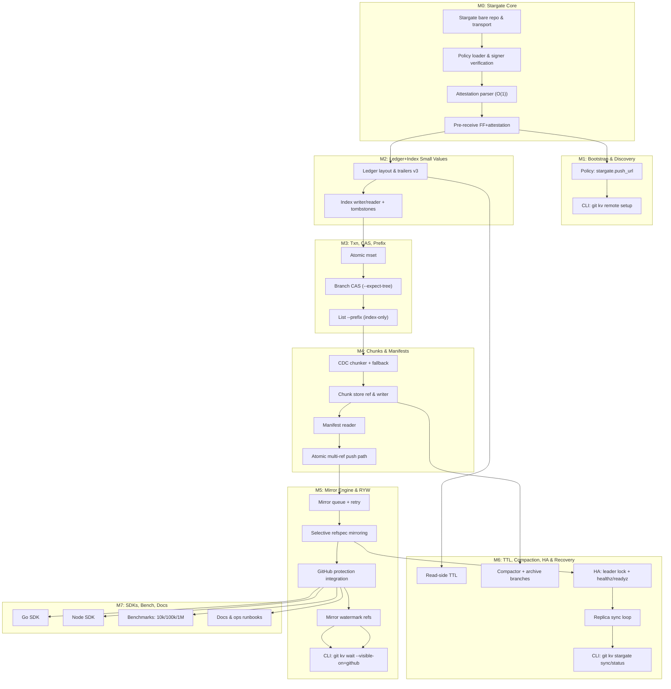

> git‑kv v3.1 — Project Stargate

**Tagline**: State as code. Commits are transactions. Git is the database. GitHub is the showroom.

---

## Table of Contents

1. Executive Summary
2. Scope & Non‑Goals
3. Terminology
4. System Architecture
5. Repository Model & Ref Topology
6. Tree Layouts (Ledger / Index / Chunks)
7. Transactions & Client Attestation
8. Consistency Model & Read‑After‑Write Options
9. Chunked Value Storage
10. Metadata, TTL, and Deletions
11. Policy & Security
12. Stargate Deployment & Mirroring
13. Hooks (pre‑receive / update / post‑receive)
14. High Availability, DR & Health
15. Observability, SLOs, Alerts
16. User Stories
17. Milestones & Production DAG
18. Test Plan
19. Risks & Mitigations
20. Appendix A — Implementation Options & Final Recommendation
21. Appendix B — CLI Interface Spec
22. Appendix C — Use Cases

---

## Executive Summary

**Stargate** inserts a transparent, local Git host in the push path. Developers still `git push origin`; a Git config trick (`pushurl`) routes writes to Stargate (LAN), which enforces linear ledger, policy, and atomic multi‑ref updates with `O(1)` verification via client attestation trailers, then mirrors to GitHub for CDN‑class read speed and UI/PR/Actions.

This design gives:

•	Ledger‑grade integrity (no merges, signed commits, CAS).
•	Fast prefix listing via a dual index ref.
•	Large values via chunk manifests (no LFS).
•	Bounded clones via epochs & snapshots.
•	Operational maturity (HA, health checks, RYW fencing, repair tools).

---

## Scope & Non‑Goals

### In-scope

- Single‑repo, branch‑scoped KV with atomic multi‑key commits.
- Strong audit trail; deterministic behavior; portable artifacts.
- Low‑latency writes on LAN; eventual consistency for GitHub mirror.

### Out of scope

- Sub‑ms latency or 100k QPS (use Redis for that).
- Cross‑repo transactions.
- Full secret-management (we store bytes; encrypt them if needed).

---

## Terminology

- **Ledger**: authoritative branch of values (`refs/kv/<ns>`), linear history.
- **Index**: prefix‑sharded pointer files for fast listing (`refs/kv-index/<ns>`).
- **Chunks**: per‑epoch content store for large values (`refs/kv-chunks/<ns>@<epoch>`).
- **Epoch**: snapshot boundary for bounded clone size (`kv-epoch/<ns>` points to current).
- **Stargate**: local git host/relay enforcing guarantees and mirroring to GitHub.

---

## System Architecture

```bash
dev clone
  git fetch origin  ─────────→  GitHub (CDN, UI)
  git push origin   ─────────→  Stargate (LAN, authoritative)
                                   │ pre-receive (O(1) attestation, policy)
                                   └─ post-receive mirror → GitHub
```

**Transparency**: user keeps origin. Only the push path is rewritten via:

```bash
[remote "origin"]
  url     = git@github.com:org/repo.git         # reads
  pushurl = ssh://git@stargate.local/org/repo.git  # writes
```

---

## Repository Model & Ref Topology

```bash
refs/
  kv/<ns>                      # Ledger (linear fast-forward only)
  kv-index/<ns>                # Prefix index (FF only)
  kv-chunks/<ns>@<epoch>       # Chunk store per epoch
  kv-epoch/<ns>                # Pointer (lightweight tag/ref) to current epoch
  kv-archive/<ns>@<epoch>      # Frozen prior epochs (optional)
  kv-watchlog/<ns>@<epoch>     # Append-only change feed per epoch
  kv-mirror/<ns>               # Mirror watermark (last confirmed mirrored OID)
```

---

## Tree Layouts (Ledger / Index / Chunks)

### Ledger tree (`refs/kv/<ns>`):

```bash
kv/<ns>/
  data/<hh>/<hh>/<urlsafe-key>                 # inline values (≤ value_inline_max)
  data/<hh>/<hh>/<urlsafe-key>.manifest.json   # manifest for chunked values
  meta/<hh>/<hh>/<urlsafe-key>.meta            # canonical per-key metadata (JSON/CBOR)
```

- `hh` = first 2 + next 2 hex of `SHA‑256(key)`.

### Index tree (`refs/kv-index/<ns>`):

```bash
kv/<ns>/index/<pp>/<pp>/<urlsafe-key>.ref
```

- `pp` = first 2 + next 2 chars of the key (prefix locality).
- `.ref` is a tiny JSON pointer (or tombstone).

### Chunk store (`refs/kv-chunks/<ns>@<epoch>`):

```bash
kv/<ns>/chunks/sha256/<hh>/<hh>/<digest>  # raw chunk bytes
```

---

## Transactions & Client Attestation

### Linear Ledger Mode (default)

- Only single‑parent fast‑forwards to `refs/kv/*`, `refs/kv-index/*`.
- Client builds trees based on current tips; performs atomic multi‑ref push to Stargate.

### Attestation trailers (O(1) validation)

#### Ledger commit

```bash
KV-NS: main
KV-Txn: 01JBAX...
Base-Tree: <ledger_base_tree_oid>
KV-Index-Tree: <index_tree_oid_of_this_txn>
KV-Chunks-Tree: <chunks_tree_oid_of_this_txn or "-">
Epoch: 2025Q4
Keys-Set: 123
Keys-Del: 4
Parent-Epoch: 2025Q3
```

#### Index commit

```bash
KV-NS: main
KV-Txn: 01JBAX...
KV-Ledger-Tree: <ledger_tree_oid_of_this_txn>
```

#### Chunks commit (if present)

```bash
KV-NS: main
KV-Txn: 01JBAX...
```

**Stargate** pre‑receive compares these trailers to actual tree OIDs and rejects on mismatch. Optional sampling validates a few .ref pointers against target blobs.

**CAS**: `--expect-tree <OID>` is mandatory in linear mode; per‑key `--expect-blob` is advisory preflight.

---

## Consistency Model & Read‑After‑Write Options

- **Source of Truth**: Stargate repo. Mirror: GitHub.
- **Write ACK**: when Stargate has accepted (policy + attestation OK).
- **Mirror ACK (optional)**: `git kv wait --visible-on=github --oid <ledger_commit>` fences until GitHub shows the commit (or `refs/kv-mirror/<ns>` watermark reaches it).
- **Immediate RYW**: `git kv get --read-from=stargate` reads from Stargate instead of GitHub.

---

## Chunked Value Storage

- **Threshold**: `value_inline_max` (default 1 MiB).
- **Chunking**: FastCDC (min 64 KiB, avg 256 KiB, max 1 MiB) or fixed‑size via policy.
  - Manifest (JSON; CBOR optional) lists chunk digests + Git blob OIDs; includes value ETag (BLAKE3).
- **Dedup**: Git ODB dedupe + content addressing.
- **Reachability**: chunks are kept alive by `kv-chunks/<ns>@<epoch>`.

### Pointer (.ref)

```json
{
  "v":1, "key":"user:42:profile",
  "type":"inline|chunked|deleted",
  "ledger_blob":"<oid-or-null>",
  "manifest_blob":"<oid-or-null>",
  "size":123456, "ctype":"application/json"
}
```

### Manifest

```json
{
  "v":1, "key":"user:42:avatar", "total_size":7340032,
  "chunking":{"mode":"fastcdc","min":65536,"avg":262144,"max":1048576},
  "algo":"sha256", "git_hash":"sha256", "etype":"blake3:3ba9...",
  "chunks":[{"i":0,"size":248321,"digest":"sha256:ab12...","blob_oid":"<oid>"}]
}
```

---

## Metadata, TTL, and Deletions

- Canonical per‑key metadata: `meta/.../<key>.meta` (JSON/CBOR).

```json
{"ctype":"application/json","ttl":"2026-01-01T00:00:00Z","etag":"blake3:01HX...","created_by":"james@...","created_at":"2025-10-19T04:20:00Z"}
```

- **TTL**: enforced read‑side; expired keys are logically absent.
- **Deletes**: write tombstone .ref (`"type":"deleted"`) and remove data + meta. History remains in index and ledger.

---

## Policy & Security

`.kv/policy.yaml` adds a stargate block for discovery and admin controls.

```yaml
version: 1
stargate:
  push_url: "ssh://git@stargate.local/org/repo.git"
  read_url: "ssh://git@stargate.local/org/repo.git"    # optional
  require_mirror_ack_by_default: false
  admins:
    - "ssh-ed25519 AAAAC3... james"                    # can run 'stargate sync --force'

namespaces:
  main:
    ledger_mode: linear
    require_signed_commits: true
    max_value_inline: 1MiB
    max_value_total: 100MiB
    chunking: { mode: fastcdc, min: 64KiB, avg: 256KiB, max: 1MiB }
    allowed_prefixes: ["cfg:","user:","secret:","deploy:"]
    writers:
      - "ssh-ed25519 AAAAC3... james"
      - "ssh-ed25519 AAAAC3... ci-bot"
    forbidden: [{ lfs: true }]
    retention: { ttl_default: 365d, enforce_readside: true }
```

Enforced at Stargate:

- Signed commits (`git verify-commit`).
- FF‑only on ledger/index/epoch.
- LFS forbidden under `kv/`.
- Trailer presence & cross‑ref equality.
- Size/prefix limits.

---

## Stargate Deployment & Mirroring

### Minimal deployment

- Bare repo at `/srv/git/org/repo.git`.
- Install hooks (below).
- Add mirror remote to GitHub:

```bash
git remote add github-origin git@github.com:org/repo.git
git config remote.github-origin.push \
  +refs/kv/*:refs/kv/* \
  +refs/kv-index/*:refs/kv-index/* \
  +refs/kv-chunks/*:refs/kv-chunks/* \
  +refs/kv-epoch/*:refs/kv-epoch/* \
  +refs/kv-archive/*:refs/kv-archive/* \
  +refs/kv-watchlog/*:refs/kv-watchlog/* \
  +refs/kv-mirror/*:refs/kv-mirror/*
```

### Service

- **Binary**: `git-kv-stargate` (Go recommended).
- **Systemd unit**:
```ini
[Service]
User=git
Group=git
WorkingDirectory=/srv/git/org/repo.git
ExecStart=/usr/local/bin/git-kv-stargate \
  --repo /srv/git/org/repo.git \
  --mirror-remote github-origin \
  --policy-path /srv/git/org/repo.git/.kv/policy.yaml \
  --sample-size 32
Restart=always
```

### Mirroring

- `post-receive` queues a journaled job (append‑only file or SQLite WAL).
- Worker performs `git push --atomic` of the updated refs.
- On success, updates `refs/kv-mirror/<ns>` at GitHub to the ledger OID.

---

## Hooks (`pre‑receive` / `update` / `post‑receive`)

### `pre‑receive` (`O(1)` validator; pseudo‑Bash)

```bash
#!/usr/bin/env bash
set -euo pipefail

# Read old new ref triples from stdin
while read -r old new ref; do
  case "$ref" in
    refs/kv/*|refs/kv-index/*|refs/kv-chunks/*|refs/kv-epoch/*|refs/kv-archive/*)
      # FF check
      if ! git merge-base --is-ancestor "$old" "$new"; then
        echo "Non-FF update to $ref rejected"; exit 1
      fi
      ;;
  esac
  updates+=("$old $new $ref")
done

# Leader check (HA)
[ -f .stargate-leader ] || { echo "Not leader"; exit 9; }

# Attestation check (find triplet by KV-Txn)
# 1) Extract trailers
# 2) Map KV-Txn -> (ledger,index,chunks) expected trees
# 3) Compare to actual trees
# (Implement in Go for speed; shown as concept)
exec /usr/local/bin/git-kv-stargate-validate "${updates[@]}"
```

### `update` (FF guard per-ref)

```bash
#!/usr/bin/env bash
set -euo pipefail
old=$1 new=$2 ref=$3
case "$ref" in
  refs/kv/*|refs/kv-index/*|refs/kv-epoch/*)
    git merge-base --is-ancestor "$old" "$new" || { echo "Non-FF on $ref"; exit 1; }
    ;;
esac
```

### `post‑receive` (journal + mirror + watchlog)

```bash
#!/usr/bin/env bash
set -euo pipefail
journal=.stargate/mirror-journal.ndjson
mkdir -p .stargate

while read -r old new ref; do
  ns=$(echo "$ref" | sed -n 's#^refs/kv/\([^/]*\).*$#\1#p')
  epoch=$(git show -s --format='%(trailers:key=Epoch,valueonly)' "$new" || true)
  [ -z "$ns" ] || [ -z "$epoch" ] || {
    echo "{\"ns\":\"$ns\",\"epoch\":\"$epoch\",\"oid\":\"$new\",\"ref\":\"$ref\",\"ts\":\"$(date -Is)\"}" >> "$journal"
    # write watchlog (local)
    printf '%s\n' "{\"ns\":\"$ns\",\"epoch\":\"$epoch\",\"oid\":\"$new\",\"ts\":\"$(date -Is)\"}" \
      | git hash-object -w --stdin > /dev/null
  }
done

# Mirror worker (fire-and-exit or daemonized)
systemctl --user start git-kv-stargate-mirror || true
```

In practice, the validator, journaler, and mirror worker live inside the `git-kv-stargate` daemon for performance and maintainability.

---

## High Availability, DR & Health

### Mode: Active‑passive (recommended)

- Standby continuously `git fetch --mirror` from primary.
- Virtual IP/DNS `stargate.local` points to leader.
- Pushes to standby are rejected with `exit 9` (“not leader”).

### Health endpoints

- `/healthz` → repo readable, hooks loaded.
- `/readyz` → leader, mirror remote reachable, queue draining.

### Backups 

- nightly `git bundle` or `pack snapshot` of Stargate repo to object storage.

### Recovery

- `git kv stargate sync --repair|--force` ensures GitHub mirror matches Stargate refs.

---

## Observability, SLOs, Alerts

### SLOs

- Write accept latency (Stargate): p95 < 150 ms.
- Mirror lag (accept → GitHub visible): p95 < 2 s; p99 < 10 s.
- 24h mirror success rate ≥ 99.9%.

### Metrics

- `stargate.txn.accepted|rejected|latency_ms`
- `stargate.mirror.enqueued|succeeded|failed|latency_ms`
- `stargate.mirror.backlog_size`
- `stargate.ha.role` (0 passive / 1 active)
- `stargate.health.ready{github=true|false}`

### Alerts

- Mirror backlog > N for T minutes
- p95 mirror lag > SLO for T minutes
- Role flapping > 3/hour
- Sync drift detected

---

## User Stories

**Abbrev**: `GW`=Stargate, `L`=ledger, `I`=index, `S`=chunks, `H`=hooks, `P`=policy.

### US‑G1 — Provision Stargate + Bootstrap

> As an operator, I bring Stargate online and make pushes transparent.

**Accept**: `git kv remote setup` sets `pushurl` from policy; GitHub protected; mirrors configured.

**Depends**: `P.stargate`, hooks, mirror remote.

### US‑G2 — Atomic transaction via Stargate

> As a dev, my `mset` lands atomically with fast feedback.

**Depends**: attestation trailers; `H.pre‑receive`.

### US‑G3 — Mirror resilience & RYW

> As a dev/CI, `I` can fence on GitHub visibility or read from Stargate.

**Depends**: `kv-mirror/<ns>` watermark; `git kv wait`; optional `--read-from=stargate`.

### US‑3 — Prefix list (index‑only)

**Depends**: `I` writer/reader.

### US‑4 — CAS on branch

**Depends**: linear ledger; `H.FF enforcement`.

### US‑5 — Chunked values without LFS

**Depends**: `S` writer/reader; manifest format.

### US‑6 — Epoch rollover

**Depends**: snapshot/export/import; epoch pointer; Parent‑Epoch trailers.

### US‑7 — Watch feed

**Depends**: watchlog per epoch written in post‑receive; mirrored.

### US‑8 — Policy enforcement

**Depends**: `H.pre‑receive`; signer checks.

### US‑9 — History across epochs

**Depends**: Parent‑Epoch traversal.

### US‑G10 — HA failover

**Depends**: leader lock, health endpoints, replica sync.

### US‑G11 — Split‑brain recovery

**Depends**: `git kv stargate sync` tooling, admin policy.

### US‑G12 — Discovery on fresh clone

**Depends**: `git kv remote setup`, `policy.stargate.push_url`.

---

## Milestones & Production DAG

### Milestones

- **M0**: Stargate core (repo, `O(1)` validator, FF hooks)
- **M1**: Bootstrap & Discovery (remote setup)
- **M2**: Ledger+Index (small values, tombstones)
- **M3**: Txns, CAS, Prefix list
- **M4**: Chunks & Manifests (multi‑ref push)
- **M5**: Mirror Engine & RYW (kv-mirror, wait)
- **M6**: TTL, Compaction, HA & Recovery (sync)
- **M7**: SDKs, Benchmarks, Docs

### graph TD



---

## Test Plan (must‑pass)

- **Correctness**: inline & chunked round‑trip; atomic multi‑ref; CAS conflict; TTL exclusion; history traversal across epochs.
- **Integrity**: attestation mismatch rejection; pointer/index/ledger/chunks consistency; forbidden LFS.
- **Scale**: 1M keys; `prefix list` p95 < 150 ms on warm cache; CDC update of 100MB with 5% change → <6MB new bytes.
- **HA**: failover during push; mirror backlog drains after recovery.
- **RYW**: `kv wait` fences correctly in CI.
- **Recovery**: `stargate sync --repair` heals drift; `--force` overwrites safely with lease.

---

## Risks & Mitigations

- Gateway SPOF → HA, leader lock, `healthz`/`readyz` (mandatory in prod).
- Mirror lag → `git kv wait` + optional direct reads from Stargate.
- Journal corruption → append‑only + `fsync`; snapshot to rotate.
- Human foot‑guns → protected branches on GitHub; Stargate is sole pusher.
- Giant values → chunking, size limits, disallow LFS.

---

## Appendix A — Implementation Options & Final Recommendation

### Languages

- **Go (✅ RECOMMENDED)**: great git tooling (go‑git + shelling to git), static binaries, fast IO, easy concurrency, small footprint.
- **Rust**: performance & safety A+, but slower iteration; async complexity high.
- **Node/TS**: fast to build, weaker for heavy IO, process mgmt less ideal for hooks.
- **Python**: excellent for CLI/ops, not ideal for long‑running daemon + high concurrency.

**Call**: Go for `git-kv-stargate` & CLI, optional Rust for chunker later.

### Git Integration

- **Shell out to `git` (✅)**: aligns with server hooks; correct behavior; uses pack heuristics; easiest to maintain.
- **libgit2**: powerful; C bindings overhead, memory complexity.
- **go‑git**: pure Go; slower for packfile performance; fine for read‑paths.

**Call**: Shell to git for write paths & validation; use go‑git for read convenience.

### Network / Transport

- **SSH (✅)**: mature auth; `pushurl` fits perfectly.
- **Smart HTTP**: fine for reads; more moving parts to secure for writes.

**Call**: SSH for pushes, Smart HTTP optional for `healthz`/`metrics`.

### Chunking

- **FastCDC (✅)**: stable, fewer new chunks when content shifts.
- **Fixed‑size**: simpler but wastes bytes when content shifts.
- **Rabin‑Karp**: similar to CDC; libs vary.

**Call**: FastCDC default, fixed‑size fallback via policy.

### Hashing

- **SHA‑256 repo hash (✅)**: modern Git supports; future‑proof.
- **BLAKE3 for ETags (✅)**: fast; independent of repo hash.

### Journal

- **Append‑only file (✅)**: simple, robust, easy to replay.
- **SQLite WAL**: stronger semantics; adds dependency.

**Call**: start append‑only, upgrade to SQLite if you need multi‑tenant throughput.

### Leader Lock

- **Flock + VIP/DNS (✅)**: simplest reliable.
- **etcd/Consul**: overkill unless multi‑site.

**Call**: flock + virtual IP + health checks.

### Observability

- Prometheus (✅), OpenTelemetry optional; logs in NDJSON; ship Grafana dashboard.

### Security / Signing

- SSH commit signing (✅) or GPG; require signed commits per policy; enforce in pre‑receive.

### Packaging

- Systemd (✅), Docker optional; keep OS deps minimal (git, ssh).

### Final Recommendation

- Implementation in Go, shell to git for heavy lifting.
- SSH push path, FastCDC chunking, BLAKE3 ETags.
- Append‑only journal, flock leader lock, Prometheus metrics.
- Systemd service as default footprint, Docker for quick trials.

---

## Appendix B — CLI Interface Spec

### Global

```bash
git kv [--ns <namespace>] [--json] [--debug]
Exit codes: 0 ok; 2 CAS conflict; 3 policy violation; 4 key invalid;
            5 IO/git error; 7 expired; 8 attestation mismatch;
            9 not leader; 10 mirror timeout; 11 sync refused
```

### Commands

#### `init`

```bash
git kv init [--ns main]
```

Create initial refs & policy scaffold (local only).

#### `remote setup`

```bash
git kv remote setup
```

Read `.kv/policy.yaml.stargate.push_url` and set `origin.pushurl`.

#### `get`

```bash
git kv get <key> [--raw|--json] [--read-from=github|stargate] [--allow-expired]
```

Fetch value from mirror (default) or Stargate.

#### `set`

```bash
git kv set <key> <file|-|inline> [--ctype ...] [--ttl ...] [--max-inline N]
```

Write single value. Auto‑chunks above threshold.

#### `del`

```bash
git kv del <key>...
```

Tombstone .ref, remove data/meta.

#### `mset`

```bash
git kv mset --file <batch.jsonl>
```

Batch ops (JSONL):

```json
{"op":"set","key":"cfg:flag","ctype":"application/json","value_b64":"..."}
{"op":"del","key":"secret:old"}
```

#### `cas set`

```bash 
git kv cas set <key> <file> --expect-blob <oid> --expect-tree <oid>
```

Per‑key + branch CAS.

#### `list`

```bash
git kv list [--prefix P]
```

Index‑only listing; excludes TTL‑expired by default.

#### `history`

```bash
git kv history <key> [--epochs]
```

Traverse Parent‑Epoch chain.

#### `snapshot`

```bash
git kv snapshot --export <file.jsonl>
```

Export current view.

#### `import`

```bash
git kv import <file.jsonl>
```

Import snapshot.

#### `epoch new`

```bash
git kv epoch new --label 2025Q4
```

New epoch branch; update kv-epoch/<ns>.

#### `compact`

```bash
git kv compact [--epoch <label>] [--dry-run]
```

Archive or squash old versions according to policy.

#### `watch`


```bash
git kv watch [--since <oid>] [--json]
```

Stream watchlog.

#### `wait`

```bash
git kv wait --oid <ledger_commit> --visible-on=github [--timeout 60s]
```

Fence until mirror shows commit OID (or watermark >= OID).

#### `stargate status`

```bash
git kv stargate status [--json]
```

Show leader status, mirror backlog, last mirror time.

#### `stargate sync`

```bash
git kv stargate sync [--ns <ns>] [--repair|--force|--hard] [--dry-run]
```

Compare/repair/force GitHub mirror to match Stargate refs.

---

## Appendix C — Use Cases

These are either not feasible or painful without `git‑kv` Stargate, and now clean:

### Audit‑grade Feature Flags & Policy Toggles

 - Atomic multi‑key flips with signed commits.
 - Rollback by commit hash; provenance in trailers.

### Regulated Config / Compliance Evidence

- Signed, immutable ledger of changes.
- Per‑key TTL for policy artifacts; snapshots for audits.

### ML Model Registry (No LFS, Dedup by CDC)

- Store model binaries & manifests via chunking; dedup across versions.
- Reproducibility by commit OID; offline replication.

### GitOps State for Air‑Gapped Environments

- Stargate as the authoritative store in the secure zone; mirror to public GitHub for visibility.
- Read directly from Stargate for RYW in control planes.

### IoT / Edge Config Distribution

- Offline‑first replication; devices fetch from nearest mirror; state is just Git.
- Epochs keep on‑device clones small.

### Secrets Rotation Records (Encrypted Payloads)

- Values are pre‑encrypted (e.g., age or KMS).
- Ledger documents when and by whom rotations occurred; TTL marks expiry.

### Data Pipeline Checkpoints & Manifests

- Each stage writes atomic manifests; downstream waits with `git kv wait`.
- Full lineage in commit history.
 
### Release Coordination Across Microservices

- One transaction flips multiple service pins atomically.
- CI consumers `git kv wait` before deploy step to avoid stale reads.

### Disaster‑Recovery Runbooks as State

- DR steps encoded as KV with timestamps, owners, approvals in trailers.
- Snapshots tag DR drills and real incidents for later audits.

### Org‑wide “Known Good” References

- Centralized pointers to approved artifacts (SBOMs, container digests) with enforcement via policy.
- Teams read RYW from Stargate in critical paths; the rest read from GitHub.
